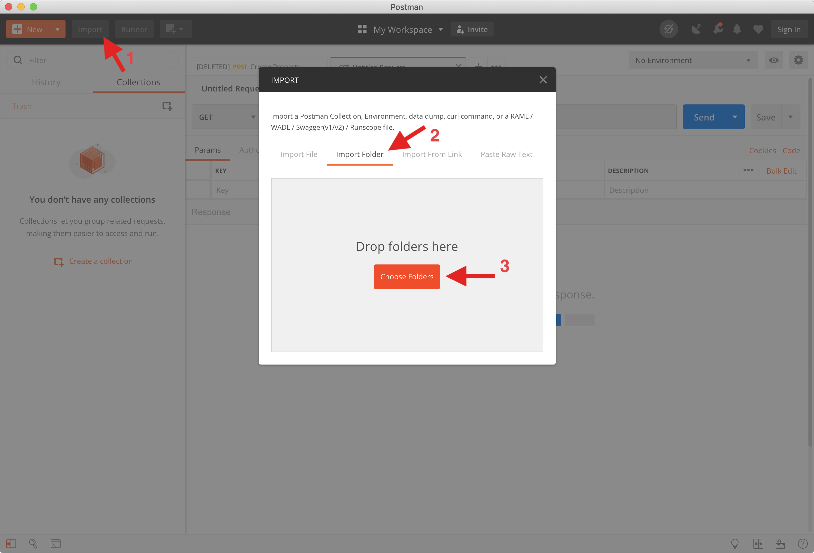
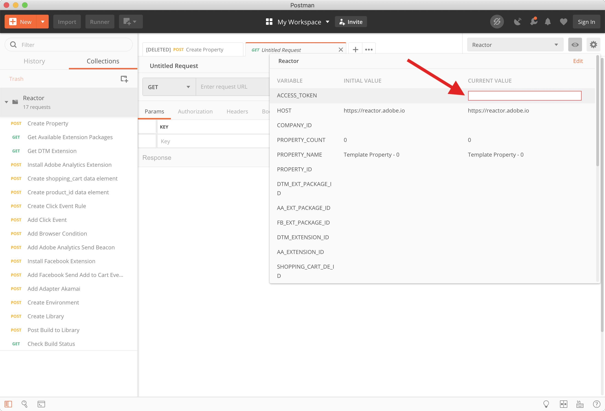
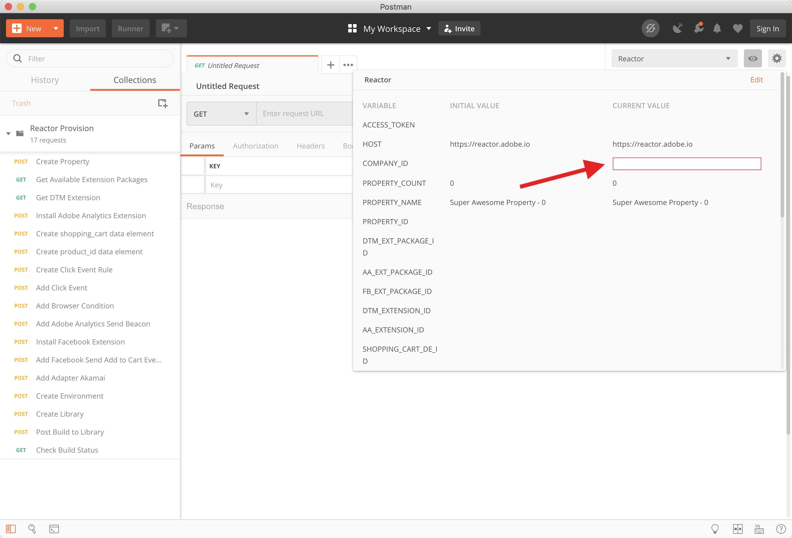

# Reactor Postman
A Postman collection of Reactor API examples for the Adobe Experience Platform
Cloud Launch.
This collection shows a simplified use case of provisioning a new property,
creating extensions rules and data elements, and initiating a library build.

Check out the [Launch Docs](https://developer.adobelaunch.com/) for detailed
guides and help.

## Contributing

Contributions are encouraged and welcomed! Please read the [Contributing
Guide](CONTRIBUTING.md) for more information.

## Usage

To get started:

1. Install [Postman](https://www.getpostman.com/).
3. Clone the repository.
4. Import the folder into Postman
5. Set your access token
6. Set your company

## Importing the collection
You can import the entire collection and environment in one go:

## Setting the Access Token
To interact with the Launch Reactor APIs, you must have a valid access token and
the correct permissions configured. The provision collection requires the
development permissions to create resources and a development library. Check out
the [Launch Docs](https://developer.adobelaunch.com/) for more details on
creating Adobe I/O integrations and permissioning.

#### Adobe I/O integration
If you have an Adobe I/O integration ready to go, the collection will
automatically authenticate and set the access token variable if configured. This
[walkthrough](https://developer.adobelaunch.com/guides/extensions/getting-started/#create-an-adobe-io-technical-account)
will help you get started creating your integration

Once you've created your integration, you will need to set the following
environment variables in Postman:
* CLIENT_SECRET
* API_KEY
* IMS_HOST
* ISS
* SUB
* METASCOPE
* PRIVATE_KEY

#### Directly setting the access token
If the `ACCESS_TOKEN` variable is already set, the collection will use that
value instead of trying to create one. You can directly set the `ACCESS_TOKEN`
variable in your environment if you haven't/don't want to create an integration
yet.

#### Setting the company id
Before you can start making calls, you also need to set the company id for your
company.
Technical Adobe I/O accounts are tied to a single organization/company.
Ideally, we would correlate the org id to the list from a call to the
[/companies](https://developer.adobelaunch.com/api/companies/list/) endpoint.
Until we get that in place, *cough*PR*cough*, you'll need to set it manually.
You can get your company id from the Launch URL 
CHECK YOUR ACTIVE ORGANIZATION TO ENSURE YOU ARE USING THE CORRECT COMPANY!

Now you can set that value in your environment

#### Running the requests
Each request builds on the previous request and demonstrates an end-to-end
property creation to publish.
Details on the specifications, headers, and attributes can be found for each
endpoint in the [Launch Docs](https://developer.adobelaunch.com/)
At the completion of each request, various environment variables required for later will be set using the postman `test` and `postman.setEnvironmentVariable`

## Licensing

This project is licensed under the Apache V2 License. See [LICENSE](LICENSE) for
more information.

